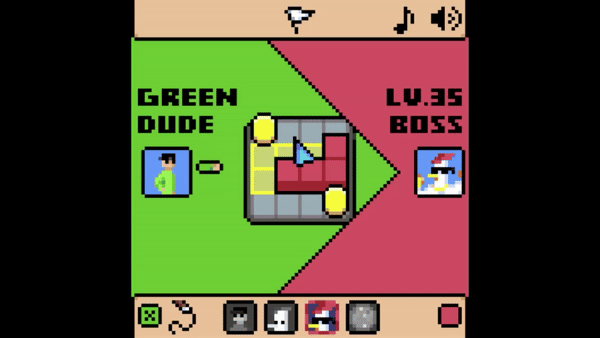

# L Game - A Study Case in Game Programming

## Description
This project is a study case focused on learning game programming principles using the **L Game** as a practical example. The goal is to teach and explore various aspects of game development, including:

- **Pixel Art**: Drawing 2D sprites in a Isometric Pixel art style.
- **Sound Design**: Composing background music and sound effects.
- **2D Transitions**: Smooth and responsive movements for game objects and animations.
- **Game Juice**: Enhancing player experience with polished feedback like visual effects, animations, and sounds.
- **Game programming**: Implementing a turn-based system with validation and AI logics allowing players to compete agains computer-controlled opponents.
- **Network Programming**: Implementing multiplayer functionality via WebSockets, allowing players to connect and play over the internet.

The game offers multiple modes of play:
- **Versus Bots** (/): Play against two levels of AI difficulty.
- **Local Multiplayer** : Two players can compete on the same device.
- **Online Multiplayer** : Play over the internet (requires setting up this simple [WebSocket Server](https://github.com/lhuthng/websocket-server) if my host is unavailable).

## Demo

## Rules of the L Game
The L Game is played on a 4x4 board . Each player controls an L-shaped piece (/), which occupies 3 squares. On each turn, players:
1. Move their L-shaped piece (/) to a new valid position.
2. Optionally move one of the two neutral pieces () to block the opponent.

A player loses if they cannot move their L-shaped piece on their turn.
